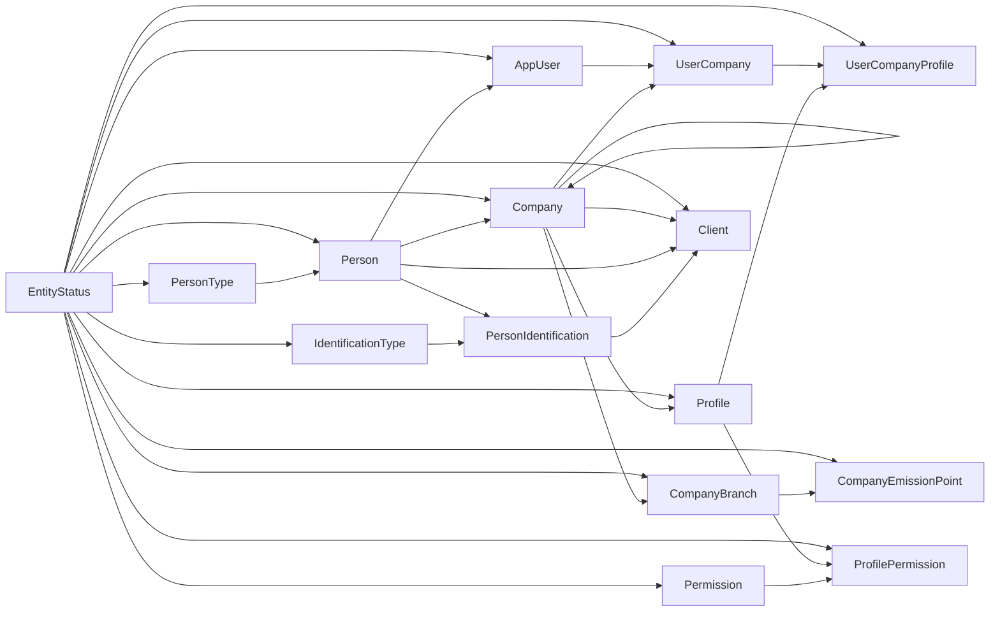

# Diagrama entidad-relación: personas globales y clientes

| Entidad | Clave y relación |
| --- | --- |
| `Person` | Maestro global; `PersonKind` referencia `PersonType`. |
| `PersonIdentification` | Única por `(IdentificationTypeId, NormalizedIdentification)`; pertenece a `Person`. |
| `Client` | Única por `(CompanyId, PersonId)`; es local a la empresa. |
| `Client`–`PersonIdentification` | FK compuesta `(DefaultBillingIdentificationId, PersonId)` que garantiza propiedad de la identificación facturable. |
