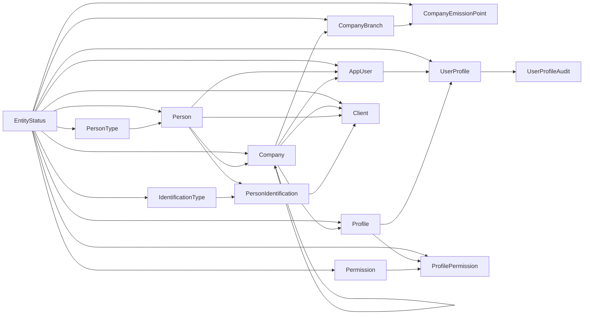

# Diagrama entidad-relación: personas globales y clientes

| Entidad | Clave y relación |
| --- | --- |
| `IdentificationType` | Catálogo con `Code` único para contratos y `Status` como única vigencia; mantiene la PK interna `IdentificationTypeId` para FKs. |
| `Person` | Maestro global; `PersonKind` referencia `PersonType`. |
| `PersonIdentification` | Única por `(IdentificationTypeId, NormalizedIdentification)`; pertenece a `Person`. |
| `AppUser` | Pertenece a una sola `Company`; no guarda un perfil directo. |
| `UserProfile` | Asigna multiples perfiles de la misma empresa a cada usuario, con FKs compuestas a `AppUser` y `Profile`. |
| `UserProfileAudit` | Historial append-only de asignaciones, reactivaciones y revocaciones, sin borrado en cascada. |
| `Client` | Única por `(CompanyId, PersonId)`; es local a la empresa. |
| `Client`–`PersonIdentification` | FK compuesta `(DefaultBillingIdentificationId, PersonId)` que garantiza propiedad de la identificación facturable. |
