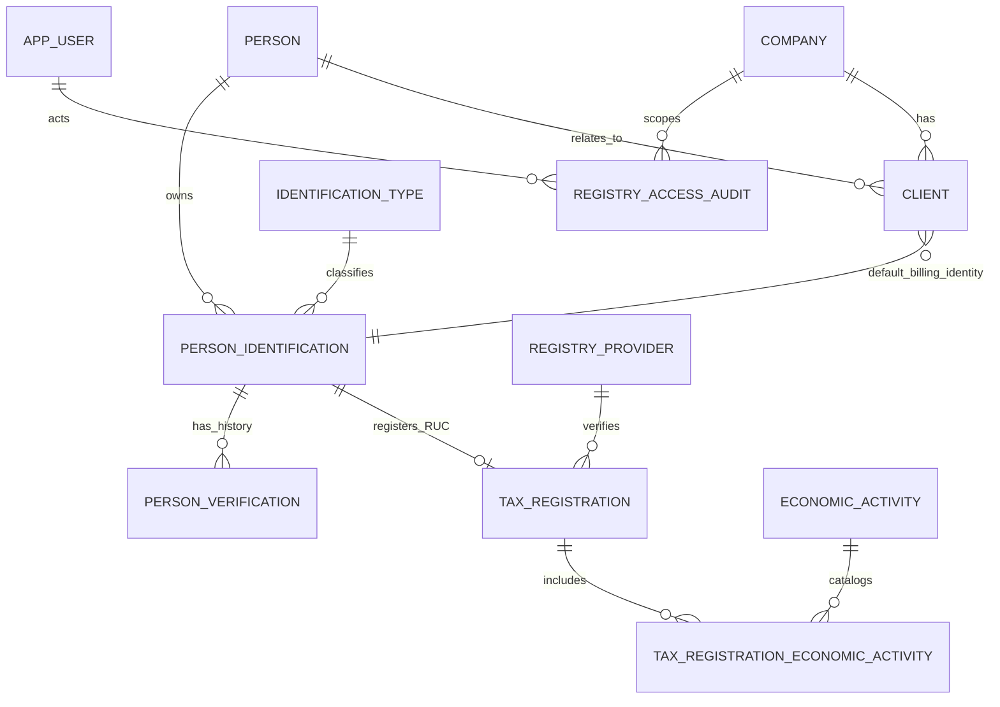

# Addendum de modelo: registro global de clientes

Este documento complementa el diccionario, el diagrama ER y el contrato backend/API existentes para la migración `centralizar-registro-global-clientes`.

## Entidades y propiedad de datos

| Entidad | Propietario | Datos esenciales |
| --- | --- | --- |
| `Person` | Global | Identidad fiscal, `LegalName`, `TradeName`, `PersonKind`. No contiene contacto ni cartera por tenant. |
| `PersonIdentification` | Global | Tipo, identificación visible, normalizada, vigencia y estado de verificación. Unicidad global por tipo+normalizado. |
| `TaxRegistration` | Global/verificada | Datos permitidos del RUC. `TaxAddress` no es una dirección de facturación. |
| `EconomicActivity` | Global | Catálogo por código Nicole; el ID de proveedor es solo referencia opaca. |
| `PersonVerification` | Global | Resultado, proveedor, vigencia, correlación y hash SHA-256; nunca JSON crudo. |
| `RegistryAccessAudit` | Seguridad | Tenant, usuario, resultado y correlación mínimos, sin PII duplicada. |
| `Client` | Tenant | Relación `Company`–`Person`, contacto local, dirección de facturación, crédito y plazos. |

`Client(DefaultBillingIdentificationId, PersonId)` referencia la clave candidata de `PersonIdentification`; por ello no puede elegirse la identificación de otra persona. `Client(ClientId, CompanyId)` debe ser la referencia compuesta de una factura futura.

## Contrato backend/API

- `POST /registry/resolve`: recibe tipo y valor exactos, llama primero a `usp_Registry_ResolveIdentification` con `UserId` y `CompanyId` autenticados. Si devuelve refresco requerido, el backend consulta el proveedor y persiste la respuesta mediante `usp_Registry_PersistVerification`.
- Los adaptadores de proveedores aplican timeout, reintento y normalización fuera de SQL. Sus secretos viven en un gestor de secretos, no en `RegistryProvider`.
- `POST /clients`, `PATCH /clients/{clientId}` y `POST /clients/{clientId}/deactivate` usan los procedimientos `usp_Client_*` con `CompanyId` del contexto autorizado. No existe endpoint global por nombre o identificación parcial.
- La UI puede mostrar `TaxAddress` como sugerencia, pero debe exigir la confirmación y entrada local explícita antes de enviar `BillingAddress`.

## Contrato de factura futuro

Al emitir, `Invoice` deberá conservar `BuyerIdentificationType`, `BuyerIdentification`, `BuyerLegalName`, `BuyerAddress` y `BuyerEmail` como snapshot inmutable. La FK obligatoria será `(ClientId, CompanyId) → Client(ClientId, CompanyId)`; jamás una FK por `ClientId` aislado. Esta migración no crea la tabla ni procesa facturas.
