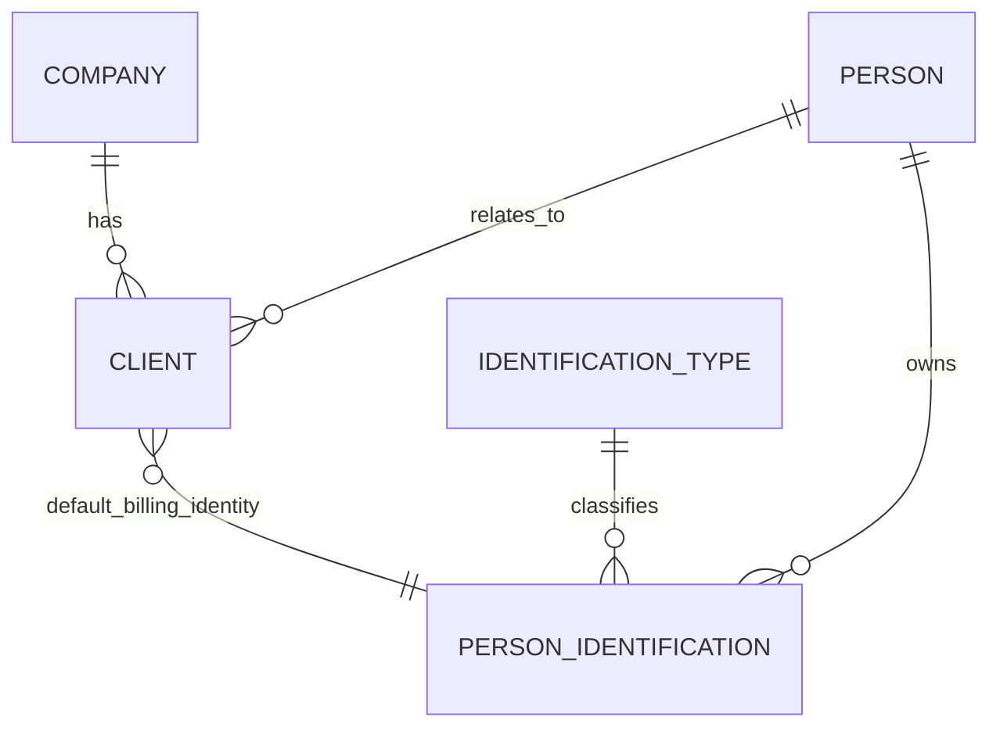

# Modelo: personas globales y clientes por empresa

## Propiedad de datos

| Entidad | Propietario | Datos |
| --- | --- | --- |
| `Person` | Global | Clase natural/jurídica, nombre legal y nombre comercial opcional. |
| `PersonIdentification` | Global | Tipo, valor visible, valor normalizado y pertenencia a una persona. |
| `Client` | Tenant | Relación `Company`–`Person`, dirección de facturación, teléfono, correo, crédito y plazo. |

```mermaid
erDiagram
  COMPANY ||--o{ CLIENT : has
  PERSON ||--o{ CLIENT : relates_to
  PERSON ||--o{ PERSON_IDENTIFICATION : owns
  IDENTIFICATION_TYPE ||--o{ PERSON_IDENTIFICATION : classifies
  CLIENT }o--|| PERSON_IDENTIFICATION : default_billing_identity
```

## Flujo backend

El backend busca una identificación exacta en `PersonIdentification`. Si existe, la empresa confirma la persona global y crea su relación `Client`. Si no existe, el backend puede consultar cédula o RUC para sugerir campos del formulario; ante fallo o ausencia de datos, el usuario los ingresa manualmente.

Solo el usuario confirmado genera persistencia. No se conservan respuestas, resultados, errores ni metadatos del servicio externo.
