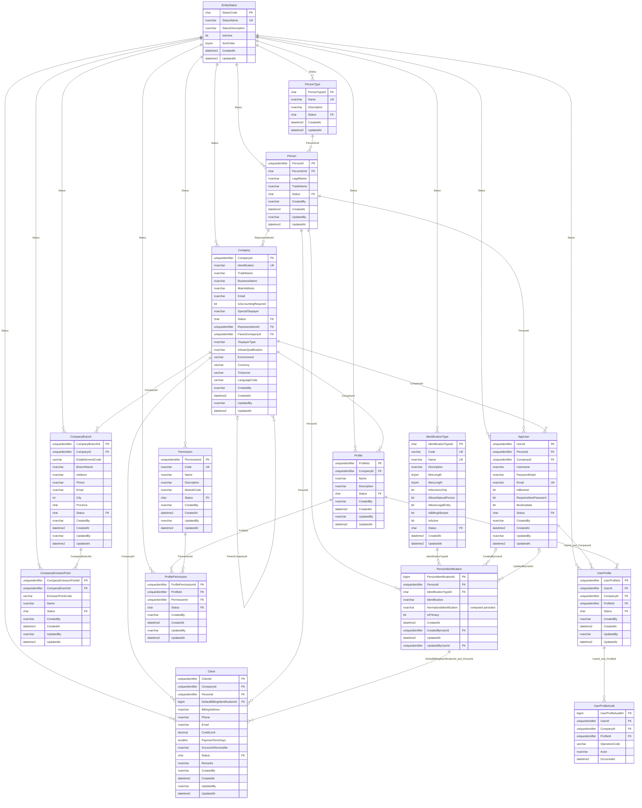

# Diagrama detallado de base de datos

Este diagrama es un reflejo del DDL base de `database/tables/`. Debe actualizarse junto con ese DDL: cada tabla y cada columna física, incluida una columna calculada, debe aparecer aquí.

## Restricciones compuestas y filtradas

Las siguientes claves no pueden expresarse como una marca en una sola columna del diagrama y se conservan aquí para completar la lectura del modelo:

| Tabla | Restricción |
|---|---|
| `CompanyBranch` | `UQ_CompanyBranch_Company_EstablishmentCode (CompanyId, EstablishmentCode)` |
| `CompanyEmissionPoint` | `UQ_CompanyEmissionPoint_Branch_EmissionPointCode (CompanyBranchId, EmissionPointCode)` |
| `Profile` | `UQ_Profile_Company_Name (CompanyId, Name)` y `UQ_Profile_ProfileId_CompanyId (ProfileId, CompanyId)` |
| `ProfilePermission` | `UQ_ProfilePermission_Profile_Permission (ProfileId, PermissionId)` |
| `AppUser` | Clave `UQ_AppUser_UserId_CompanyId` para la FK compuesta de asignaciones; no almacena `ProfileId`. |
| `UserProfile` | `UQ_UserProfile_User_Profile (UserId, ProfileId)` evita duplicados; FKs compuestas a `AppUser (UserId, CompanyId)` y `Profile (ProfileId, CompanyId)`. |
| `UserProfileAudit` | FKs sin cascada a `UserProfile`, `AppUser` y `Profile`; eventos append-only identificados por `OperationCode`, `Actor` y `OccurredAt`. |
| `PersonIdentification` | `UQ_PersonIdentification_Type_Normalized (IdentificationTypeId, NormalizedIdentification)`, `UQ_PersonIdentification_Id_Person (PersonIdentificationId, PersonId)` y el índice filtrado `UX_PersonIdentification_OnePrimaryPerPerson (PersonId) WHERE IsPrimary = 1` |
| `Client` | `UQ_Client_Company_Person (CompanyId, PersonId)`, `UQ_Client_Client_Company (ClientId, CompanyId)` y FK de facturación `(DefaultBillingIdentificationId, PersonId)` a `PersonIdentification (PersonIdentificationId, PersonId)` |
