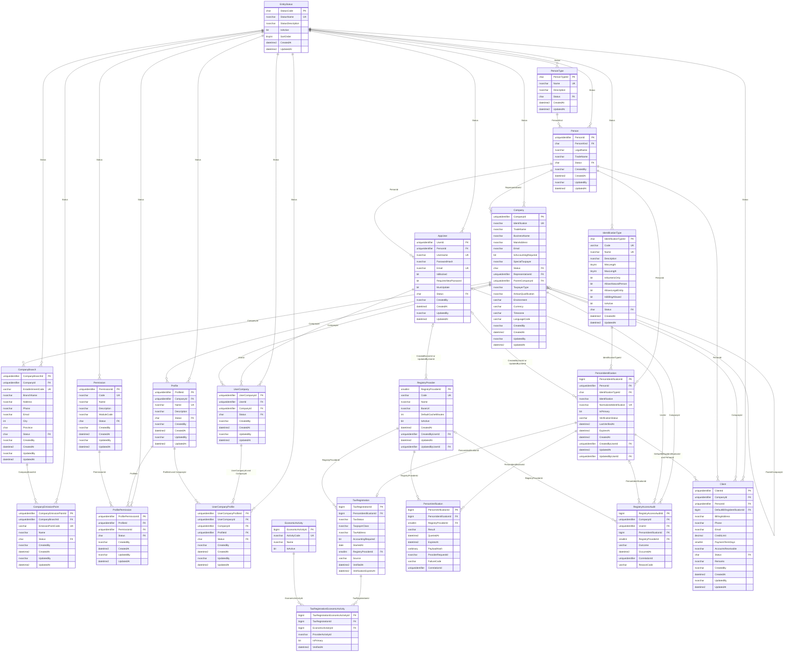

# Diagrama entidad-relación de Nicole

```mermaid
erDiagram
    EntityStatus {
        char StatusCode PK
        nvarchar StatusName UK
        nvarchar StatusDescription
        bit IsActive
        tinyint SortOrder
        datetime2 CreatedAt
        datetime2 UpdatedAt
    }

    IdentificationType {
        char IdentificationTypeId PK
        varchar Code UK
        nvarchar Name UK
        nvarchar Description
        tinyint MinLength
        tinyint MaxLength
        bit IsNumericOnly
        bit AllowsNaturalPerson
        bit AllowsLegalEntity
        bit IsBillingAllowed
        bit IsActive
        char Status FK
        datetime2 CreatedAt
        datetime2 UpdatedAt
    }

    PersonType {
        char PersonTypeId PK
        nvarchar Name UK
        nvarchar Description
        char Status FK
        datetime2 CreatedAt
        datetime2 UpdatedAt
    }

    Person {
        uniqueidentifier PersonId PK
        char PersonKind FK
        nvarchar LegalName
        nvarchar TradeName
        char Status FK
        nvarchar CreatedBy
        datetime2 CreatedAt
        nvarchar UpdatedBy
        datetime2 UpdatedAt
    }

    Company {
        uniqueidentifier CompanyId PK
        nvarchar Identification UK
        nvarchar TradeName
        nvarchar BusinessName
        nvarchar MainAddress
        nvarchar Email
        bit IsAccountingRequired
        nvarchar SpecialTaxpayer
        char Status FK
        uniqueidentifier RepresentativeId FK
        uniqueidentifier ParentCompanyId FK
        nvarchar TaxpayerType
        nvarchar ArtisanQualification
        varchar Environment
        varchar Currency
        varchar Timezone
        varchar LanguageCode
        nvarchar CreatedBy
        datetime2 CreatedAt
        nvarchar UpdatedBy
        datetime2 UpdatedAt
    }

    CompanyBranch {
        uniqueidentifier CompanyBranchId PK
        uniqueidentifier CompanyId FK
        varchar EstablishmentCode UK
        nvarchar BranchName
        nvarchar Address
        nvarchar Phone
        nvarchar Email
        int City
        char Province
        char Status FK
        nvarchar CreatedBy
        datetime2 CreatedAt
        nvarchar UpdatedBy
        datetime2 UpdatedAt
    }

    CompanyEmissionPoint {
        uniqueidentifier CompanyEmissionPointId PK
        uniqueidentifier CompanyBranchId FK
        varchar EmissionPointCode UK
        nvarchar Name
        char Status FK
        nvarchar CreatedBy
        datetime2 CreatedAt
        nvarchar UpdatedBy
        datetime2 UpdatedAt
    }

    AppUser {
        uniqueidentifier UserId PK
        uniqueidentifier PersonId FK
        nvarchar Username UK
        nvarchar PasswordHash
        nvarchar Email UK
        bit IsBlocked
        bit RequiresNewPassword
        bit MustUpdate
        char Status FK
        nvarchar CreatedBy
        datetime2 CreatedAt
        nvarchar UpdatedBy
        datetime2 UpdatedAt
    }

    Profile {
        uniqueidentifier ProfileId PK
        uniqueidentifier CompanyId FK
        nvarchar Name UK
        nvarchar Description
        char Status FK
        nvarchar CreatedBy
        datetime2 CreatedAt
        nvarchar UpdatedBy
        datetime2 UpdatedAt
    }

    Permission {
        uniqueidentifier PermissionId PK
        nvarchar Code UK
        nvarchar Name
        nvarchar Description
        nvarchar ModuleCode
        char Status FK
        nvarchar CreatedBy
        datetime2 CreatedAt
        nvarchar UpdatedBy
        datetime2 UpdatedAt
    }

    ProfilePermission {
        uniqueidentifier ProfilePermissionId PK
        uniqueidentifier ProfileId FK
        uniqueidentifier PermissionId FK
        char Status FK
        nvarchar CreatedBy
        datetime2 CreatedAt
        nvarchar UpdatedBy
        datetime2 UpdatedAt
    }

    UserCompany {
        uniqueidentifier UserCompanyId PK
        uniqueidentifier UserId FK
        uniqueidentifier CompanyId FK
        char Status FK
        nvarchar CreatedBy
        datetime2 CreatedAt
        nvarchar UpdatedBy
        datetime2 UpdatedAt
    }

    UserCompanyProfile {
        uniqueidentifier UserCompanyProfileId PK
        uniqueidentifier UserCompanyId FK
        uniqueidentifier CompanyId FK
        uniqueidentifier ProfileId FK
        char Status FK
        nvarchar CreatedBy
        datetime2 CreatedAt
        nvarchar UpdatedBy
        datetime2 UpdatedAt
    }

    RegistryProvider {
        smallint RegistryProviderId PK
        varchar Code UK
        nvarchar Name
        nvarchar BaseUrl
        int DefaultCacheMinutes
        bit IsActive
        datetime2 CreatedAt
        uniqueidentifier CreatedByUserId FK
        datetime2 UpdatedAt
        uniqueidentifier UpdatedByUserId FK
    }

    PersonIdentification {
        bigint PersonIdentificationId PK
        uniqueidentifier PersonId FK
        char IdentificationTypeId FK
        nvarchar Identification
        nvarchar NormalizedIdentification UK
        bit IsPrimary
        varchar VerificationStatus
        datetime2 LastVerifiedAt
        datetime2 ExpiresAt
        datetime2 CreatedAt
        uniqueidentifier CreatedByUserId FK
        datetime2 UpdatedAt
        uniqueidentifier UpdatedByUserId FK
    }

    TaxRegistration {
        bigint TaxRegistrationId PK
        bigint PersonIdentificationId FK
        nvarchar TaxStatus
        nvarchar TaxpayerClass
        nvarchar TaxAddress
        bit AccountingRequired
        date StartedAt
        smallint RegistryProviderId FK
        varchar Source
        datetime2 VerifiedAt
        datetime2 VerificationExpiresAt
    }

    EconomicActivity {
        bigint EconomicActivityId PK
        nvarchar ActivityCode UK
        nvarchar Name
        bit IsActive
    }

    TaxRegistrationEconomicActivity {
        bigint TaxRegistrationEconomicActivityId PK
        bigint TaxRegistrationId FK
        bigint EconomicActivityId FK
        nvarchar ProviderActivityId
        bit IsPrimary
        datetime2 VerifiedAt
    }

    PersonVerification {
        bigint PersonVerificationId PK
        bigint PersonIdentificationId FK
        smallint RegistryProviderId FK
        varchar Result
        datetime2 QueriedAt
        datetime2 ExpiresAt
        varbinary PayloadHash
        nvarchar ProviderRequestId
        varchar FailureCode
        uniqueidentifier CorrelationId
    }

    RegistryAccessAudit {
        bigint RegistryAccessAuditId PK
        uniqueidentifier CompanyId FK
        uniqueidentifier UserId FK
        bigint PersonIdentificationId FK
        smallint RegistryProviderId FK
        varchar Outcome
        datetime2 OccurredAt
        uniqueidentifier CorrelationId
        varchar ReasonCode
    }

    Client {
        uniqueidentifier ClientId PK
        uniqueidentifier CompanyId FK
        uniqueidentifier PersonId FK
        bigint DefaultBillingIdentificationId FK
        nvarchar BillingAddress
        nvarchar Phone
        nvarchar Email
        decimal CreditLimit
        smallint PaymentTermDays
        nvarchar AccountsReceivable
        char Status FK
        nvarchar Remarks
        nvarchar CreatedBy
        datetime2 CreatedAt
        nvarchar UpdatedBy
        datetime2 UpdatedAt
    }

    EntityStatus ||--o{ IdentificationType : "Status"
    EntityStatus ||--o{ PersonType : "Status"
    EntityStatus ||--o{ Person : "Status"
    EntityStatus ||--o{ Company : "Status"
    EntityStatus ||--o{ CompanyBranch : "Status"
    EntityStatus ||--o{ CompanyEmissionPoint : "Status"
    EntityStatus ||--o{ AppUser : "Status"
    EntityStatus ||--o{ Profile : "Status"
    EntityStatus ||--o{ Permission : "Status"
    EntityStatus ||--o{ ProfilePermission : "Status"
    EntityStatus ||--o{ UserCompany : "Status"
    EntityStatus ||--o{ UserCompanyProfile : "Status"
    EntityStatus ||--o{ Client : "Status"

    PersonType ||--o{ Person : "PersonKind"
    Person ||--o{ AppUser : "PersonId"
    Person ||--o{ Company : "RepresentativeId"
    Company o|--o{ Company : "ParentCompanyId"
    Company ||--o{ CompanyBranch : "CompanyId"
    CompanyBranch ||--o{ CompanyEmissionPoint : "CompanyBranchId"
    Company ||--o{ Profile : "CompanyId"

    AppUser ||--o{ UserCompany : "UserId"
    Company ||--o{ UserCompany : "CompanyId"
    UserCompany ||--o{ UserCompanyProfile : "UserCompanyId and CompanyId"
    Profile ||--o{ UserCompanyProfile : "ProfileId and CompanyId"
    Profile ||--o{ ProfilePermission : "ProfileId"
    Permission ||--o{ ProfilePermission : "PermissionId"

    Person ||--o{ PersonIdentification : "PersonId"
    IdentificationType ||--o{ PersonIdentification : "IdentificationTypeId"
    AppUser o|--o{ RegistryProvider : "CreatedByUserId or UpdatedByUserId"
    AppUser o|--o{ PersonIdentification : "CreatedByUserId or UpdatedByUserId"
    PersonIdentification ||--o| TaxRegistration : "PersonIdentificationId"
    RegistryProvider ||--o{ TaxRegistration : "RegistryProviderId"
    TaxRegistration ||--o{ TaxRegistrationEconomicActivity : "TaxRegistrationId"
    EconomicActivity ||--o{ TaxRegistrationEconomicActivity : "EconomicActivityId"
    PersonIdentification ||--o{ PersonVerification : "PersonIdentificationId"
    RegistryProvider ||--o{ PersonVerification : "RegistryProviderId"

    Company ||--o{ RegistryAccessAudit : "CompanyId"
    AppUser o|--o{ RegistryAccessAudit : "UserId"
    PersonIdentification o|--o{ RegistryAccessAudit : "PersonIdentificationId"
    RegistryProvider o|--o{ RegistryAccessAudit : "RegistryProviderId"

    Company ||--o{ Client : "CompanyId"
    Person ||--o{ Client : "PersonId"
    PersonIdentification ||--o{ Client : "DefaultBillingIdentificationId and PersonId"
```
