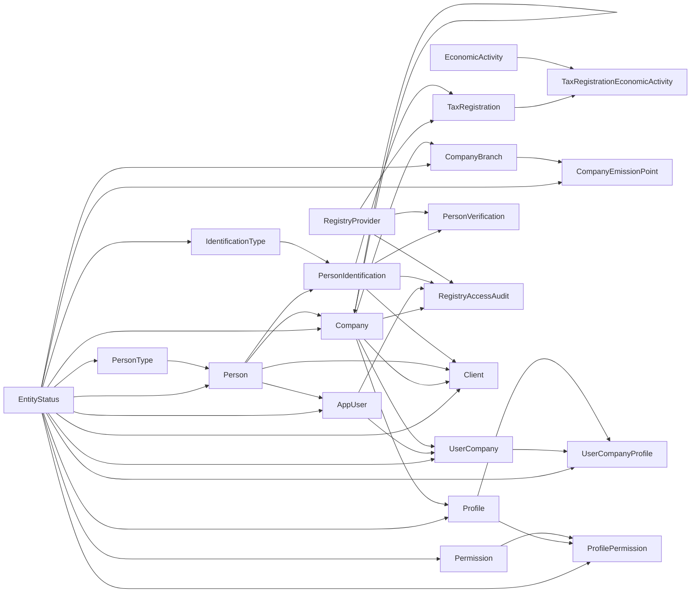

# Diagrama entidad-relacion: Nicole

Este diagrama representa el esquema final de instalacion inicial definido en `tables/` y ejecutado por `database/20260905_001_crear_bd_registro_global_clientes.sql`. Se omiten columnas de auditoria para facilitar la lectura.

## Claves y relaciones relevantes

| Entidad | PK / clave candidata | Relaciones |
| --- | --- | --- |
| `Person` | `PersonId` | Maestro global. `PersonKind` referencia `PersonType`. |
| `PersonIdentification` | `PersonIdentificationId`; única `(IdentificationTypeId, NormalizedIdentification)`; candidata `(PersonIdentificationId, PersonId)` | Pertenece a una `Person` y tiene un `IdentificationType`. |
| `TaxRegistration` | `TaxRegistrationId`; única `PersonIdentificationId` | Solo una por identidad RUC; referencia proveedor. |
| `TaxRegistrationEconomicActivity` | `TaxRegistrationEconomicActivityId`; única `(TaxRegistrationId, EconomicActivityId)` | Relación N:M entre RUC y actividad. |
| `Client` | `ClientId`; única `(CompanyId, PersonId)` y `(ClientId, CompanyId)` | Relación comercial local entre empresa y persona. |
| `RegistryAccessAudit` | `RegistryAccessAuditId` | Registra consulta por empresa, usuario, identidad y proveedor opcionales. |

La FK `Client(DefaultBillingIdentificationId, PersonId)` hacia `PersonIdentification(PersonIdentificationId, PersonId)` garantiza que la identificacion de cobro pertenece a la persona del cliente. La clave `(ClientId, CompanyId)` se reserva para la FK compuesta de una futura `Invoice`.
