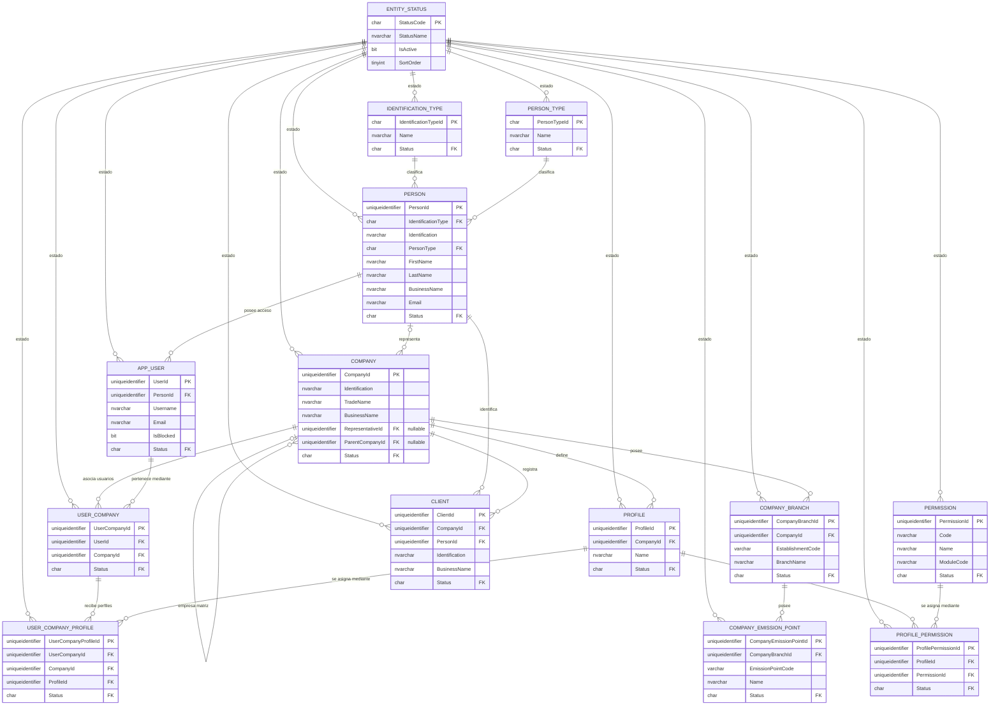

# Diagrama entidad–relación

Este diagrama se genera a partir de los scripts canónicos de `tables/`. Incluye las claves primarias, las claves foráneas y los campos funcionales más relevantes. Las columnas de auditoría se omiten para mantener la lectura clara.

## Notas del modelo

- `Company.ParentCompanyId` permite una jerarquía opcional entre empresas.
- `Company.RepresentativeId` es opcional; cuando tiene valor referencia a `Person`.
- `ProfilePermission` resuelve la relación muchos-a-muchos entre perfiles y permisos.
- `UserCompany` resuelve la relación muchos-a-muchos entre usuarios y empresas.
- `UserCompanyProfile` usa claves foráneas compuestas con `CompanyId` para impedir que se asigne a un usuario un perfil perteneciente a otra empresa.
- Todas las relaciones de estado apuntan al catálogo compartido `EntityStatus`.
